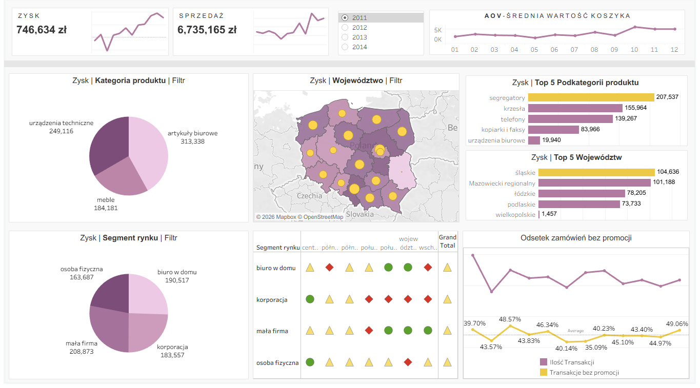

# 📝 Project Overview

This project features an interactive Power BI dashboard designed to analyze the sales, profitability, and customer segmentation of a fictional retail company operating across Poland from 2011 to 2014.

## 🗂️ The Dataset

The data used in this project is a localized Polish adaptation of the classic "Sample - Superstore" dataset. It contains thousands of rows of transactional data, including:

**Order Details:** Order IDs, Dates, Ship Modes, and Packaging.

**Customer Info:** Market Segments (Corporate, Small Business, etc.) and Customer IDs.

**Geography:** Polish Voivodeships (Województwa), Cities, and Postal Codes.

**Product Details:** Categories (Technology, Furniture, Office Supplies) and specific product names.

**Financials:** Sales (Sprzedaż), Profit (Zysk), Unit Price, Discount, and Base Margin.

Dataset is shared in repo and u can see it [here](pl_superstore.csv)

## 💡 Key Business Insights

Through the development of this dashboard, several key insights were uncovered:

 1. The Technology (Urządzenia techniczne) category—specifically copiers and phones—drives the highest profit margins compared to Furniture and Office Supplies.

 2. The Corporate segment represents the most profitable and consistent customer base.

 3. Sales volume is highly concentrated in major metropolitan voivodeships like Mazowieckie (Warsaw) and Małopolskie (Kraków).

## 🛠️ Tools & Techniques Used

Tableau Desktop: Dashboard design, interactive filtering, and data visualization.

If you'd like to check it for yourself u can open it using Tableau Desktop or Tableau Reader.
